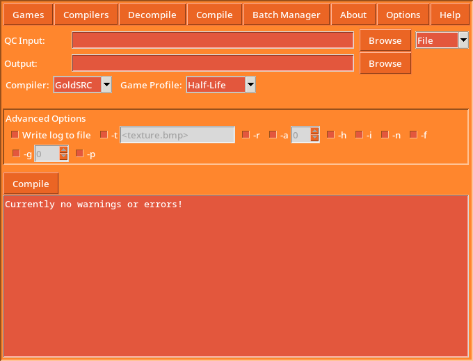
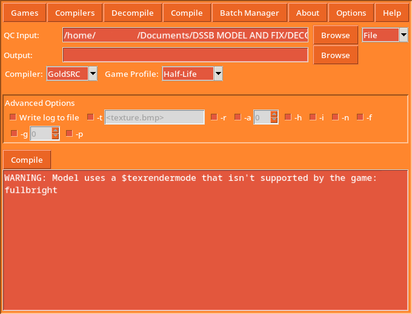

	
Table of contents:

	<dl>
		<dt><a href="#snark">Introduction</a></dt>
		<dt><a href="#why-should-i-use-snark-over-crowbar">Why should I use Snark over Crowbar?</a></dt>
		<dd>
			<a href="#its-easier-to-configure-and-use" style="">Easier to configure and use</a>
			 <a href="#natively-runs-on-windows-and-linux">Natively runs on Windows and Linux</a>
			 <a href="#better-detection-for-unsupported-features-with-compilers">Better detection of unsupported features with compilers</a>
		</dd>
		<dt><a href="#frequently-asked-questions">Frequently Asked Questions</a></dt>
		<dd>
			<a href="#why-is-this-an-alpha-release" style="">Why is this an Alpha release?</a>
			 <a href="#will-there-be-support-for-source">Will there be support for Source?</a>
			 <a href="#there-is-a-bugfeature-i-would-like-to-get-fixedimplemented-how-can-i-report-it">There is a bug/feature I would like to get fixed/implemented, how can I report it?</a>
		</dd>
		<dt><a href="#external-librariesprograms-used">External libraries/programs used</a></dt>
	</dl>

  
  <h1>Snark</h1>
	
Snark is a cross-platform alternative to the Crowbar program for GoldSRC modders, aiming to provide a similar, yet simpler workflow than what Crowbar provides.

	 
	<h2>Why should I use Snark over Crowbar?</h2>
	<h3><i>It's easier to configure and use!</i></h3>
	
In Crowbar, to decompile a model you would have to fiddle around with settings in order to get your model decompiled properly for GoldSRC. With Snark, you don't need to do any extra configuration, just select an MDL file, select the output folder, hit the decompile button and you're set!

	
	
On top of that, the compiling GUI includes all the command-line options as toggleable checks with tooltips to tell you what they do, so you don't need to check any sort of documentation, official or unofficial to use the advanced features StudioMDL offers its users.

	
	<h3><i>Natively runs on Windows and Linux!</i></h3>
	
Snark is written using Python & Tkinter, which means that native support for the major operating systems can be easily offered. You no longer need to run Crowbar under Wine for Linux systems to make models for GoldSRC, instead you can run Snark natively with proper Linux binaries. <b>Wine will still be needed to run the compilers that Snark interfaces with, make sure you have the system package installed instead of the Flatpak!</b>

	<h3><i>Better detection for unsupported features with compilers</i></h3>
	
There are many different model compilers for GoldSRC, such as the Sven Co-op compiler that introduce new features that aren't supported in other games utilising the engine. Snark uses a profile system to track which compiler and game you're using so any discrepancies between what the compiler and game supports doesn't go unnoticed by the program. For example, if you use the Svengine compiler with Half-Life instead of Sven Co-op, the compiler will warn you that Half-Life doesn't support 1024px textures or chrome textures that aren't 64x64 resolution if any of them are included in the model files.

	
	 
	<h2>Frequently Asked Questions</h2>
	<h3><i>Why is this an Alpha release?</i></h3>
	
I've made Snark an early alpha release as it isn't fully featured yet (though most things you'd need is already implemented in the program) and may contain bugs and issues that I have yet to iron out. But the most important thing is that I want the <b>community</b> to be involved in the development process, as I can't make a program that fulfills everyone's needs without their input, the things that have been implemented already are related to stuff that I already have a ton of experience (and knowledge) working on. Making Snark an alpha release allows me to achieve those goals!

	<h3><i>Will there be support for Source?</i></h3>
	
In short, no. If you want a longer answer, the reason why I won't be implementing Source support is that I have little to no experience working with the engine, my only experience is making a GMod playermodel (which I never finished). Another reason for not implementing Source support is that it would ruin Snark's simplicity since it is designed to interface with GoldSRC only, and trying to make a one-size-fits-all solution would make things more complex.

	<h3><i>There is a bug/feature I would like to get fixed/implemented, how can I report it?</i></h3>
	
If you want a bug to be fixed, open up an issue on the Github Repo and describe the issue, with steps to reproduce, operating system information, and/or terminal logs if applicable. If the program doesn't automatically open up with a terminal by default, then open up a terminal either by right-clicking and clicking 'Open in Terminal' in the context menu that pops up on Linux systems or on Windows systems, click the bar that shows the path to Snark and type 'cmd', then type in the name of the executable and hit enter (on Linux systems you need to type in './' before the executable name, otherwise the system will think it's a terminal command and not an executable). If it is a feature request, tag it as a feature request and describe what you want to have implemented into Snark. You can check the <a href="https://github.com/users/PostScriptReal/projects/1">Official Snark Development Tracker</a> to see your bug report or feature request while it's in progress.

	 
	<h2>External Libraries/Programs Used</h2>
	
Snark uses some open-source libraries for proper usage, these libraries along with their licenses are shown in the table below:

	<table>
		<tr>
			<th>Library/Program</th>
			<th>License</th>
		</tr>
		<tr>
			<td><a href="https://github.com/FWGS/xash3d-fwgs/">Xash Model Decompiler</a></td>
			<td>GPL</td>
		</tr>
		<tr>
			<td><a href="https://github.com/scardine/image_size">get_image_size</a></td>
			<td>MIT</td>
		</tr>
		<tr>
			<td><a href="https://github.com/PostScriptReal/python-ui/blob/master/tktooltip.py">tktooltip (custom fork, original at </a><a href="https://github.com/DaedalicEntertainment/python-ui/blob/master/tktooltip.py">python-ui)</a></td>
			<td>MIT</td>
		</tr>
		<tr>
			<td><a href="https://github.com/jfcarter2358/jsonc">jsonc</a></td>
			<td>MIT</td>
		</tr>
	</table>

